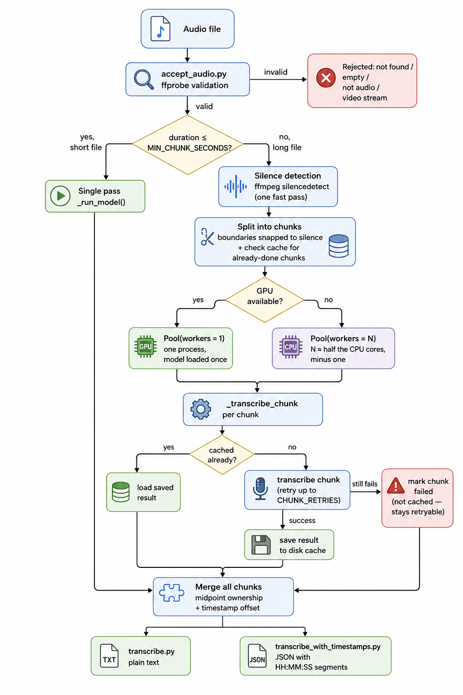

# Audio Transcription Pipeline

A small pipeline that takes an audio file, checks it's actually valid audio, and transcribes it to text with per-segment timestamps. The focus here is the engineering around the transcription (validation, long audio handling, GPU/CPU, failure recovery), not the model itself.

## What's in this repo

| File | Purpose |
|---|---|
| `accept_audio.py` | Checks a file is real, readable audio before anything else touches it |
| `transcribe.py` | Runs the transcription. Also holds the core logic: chunking, worker management, caching |
| `transcribe_with_timestamps.py` | Same transcription, formatted as timestamped segments instead of one block of text |

Both transcription scripts share the same underlying function, `transcribe_segments()` in `transcribe.py`. `transcribe.py` just joins its output into plain text, and `transcribe_with_timestamps.py` formats it as `HH:MM:SS` segments. There's one implementation of the actual pipeline, not two copies of it.

## Setup

You'll need Python 3.9+ and ffmpeg installed and on your PATH (ffprobe specifically, for validation and silence detection).

```bash
pip install -r requirements.txt
```

## Running it

```bash
python accept_audio.py audio_files/recording01.m4a
python transcribe.py audio_files/recording01.m4a
python transcribe_with_timestamps.py audio_files/recording01.m4a
```

`transcribe_with_timestamps.py` prints JSON:

```json
{
  "language": "en",
  "segments": [
    {"start": "00:00:00", "end": "00:00:05", "text": "Good morning everyone, thank you for joining the call."},
    {"start": "00:00:05", "end": "00:00:08", "text": "Today we will discuss the quarterly results."}
  ]
}
```

Sample files to try it on are in `audio_files/`.

## How it works



## Why it's built this way

### Validating audio by content, not by file extension

`accept_audio()` doesn't look at the file extension at all. It runs the file through ffprobe and checks what's actually inside it. A missing, empty, or corrupted file gets rejected. A file with no audio stream gets rejected. A video file gets rejected too, even if it happens to have an audio track, since the goal here is an audio-only pipeline.

Because ffprobe and ffmpeg do the actual decoding, any format they understand works without extra code on my end. WAV, MP3, M4A, FLAC, whatever ffmpeg supports.

### Model choice

Transcription runs on faster-whisper, using the `base` checkpoint. It's a CTranslate2 port of Whisper, and it's noticeably faster than the original implementation on CPU, which matters since this is meant to run without a GPU as the default case. `base` is a deliberate speed tradeoff. If accuracy mattered more than latency for a given use case, swapping to `large-v3` is a one-line change in `_load_model()`.

`vad_filter=True` is on for every transcription call. It uses voice activity detection to skip silence, which speeds things up and also avoids Whisper occasionally making up text over dead air.

### Long audio

Whisper already handles long files on its own. Internally it processes audio in 30 second windows and stitches the output into one transcript, so a two hour recording works fine with a single `model.transcribe()` call. No manual splitting needed to make it correct.

I still split long files into chunks, but for two separate reasons, and they're not the same reason:

**Speed, on CPU.** Whisper's internal windowing runs sequentially inside one process. If I split a long file into pieces and hand them to several processes at once, that actually cuts down wall clock time. The number of workers isn't a fixed number, it's computed from the machine:

```python
auto_cap = max(1, cpu_count() // 2 - 1)
workers = min(auto_cap, max(1, int(duration // MIN_CHUNK_SECONDS)))
```

`cpu_count() // 2` is a rough stand-in for physical core count, since hyperthreads don't help much with CPU-bound work like this. The `-1` leaves one core free so the machine doesn't get pinned. Chunks also never come out shorter than `MIN_CHUNK_SECONDS`, since a tiny chunk pays the same model-loading cost as a big one, so cutting too finely just adds overhead instead of saving time.

**Resilience, on both CPU and GPU.** This is the part that matters more, and it holds even when there's no speed benefit at all.

### GPU uses the same code, not a separate path

I check for a CUDA GPU with `ctranslate2.get_cuda_device_count()`, which comes bundled with faster-whisper already. When a GPU is available, I don't branch into different code. It runs through the exact same `multiprocessing.Pool` call as CPU, just with one worker instead of several. The reason: running several processes against one GPU doesn't parallelize anything, it just makes them compete for the same device, and each one would load its own copy of the model into VRAM for no benefit. So GPU is really just "the CPU path with one worker." That's also how I tested it, since I don't have a GPU on hand: I ran the pipeline with the worker count forced to 1 and verified the chunking, caching, and retry logic all behave the same way.

There's a `Pool` initializer, `_init_worker()`, that loads the model once per worker process and keeps it around for every chunk that worker handles. That matters a lot on GPU, where loading the model is the one cost you can't parallelize away, and it helps CPU too, since previously every chunk reloaded the model from scratch even when the same worker was handling several chunks in a row.

### Chunk count and worker count are two different numbers

This tripped me up once while building it, so it's worth calling out directly. My first version computed chunk length as `duration / workers`. That looks fine until workers is 1, which is always true on GPU. At that point it collapses into one giant chunk covering the whole file, which throws away the entire point of chunking for resilience, since there's nothing left to checkpoint partway through.

The fix keeps the two ideas separate:

```python
num_chunks = max(workers, int(duration // MIN_CHUNK_SECONDS))
chunk_length = duration / num_chunks
```

Worker count decides how much runs in parallel. Chunk count decides how fine-grained the checkpoints are. A GPU run with exactly one worker still gets split into several small chunks, processed one after another, purely so there's something to resume from if it fails partway through.

### Cutting chunks at silence instead of a fixed time mark

If you just cut a file every N seconds, you'll eventually cut through the middle of a word. `_find_silence_midpoints` runs ffmpeg's `silencedetect` once over the whole file first (fast, no transcription involved) to find actual pauses, and each planned cut point gets nudged to the nearest pause within `SNAP_SEARCH_SECONDS`. I used a one second minimum silence duration for this, long enough to skip past the tiny pause after a comma, short enough to still catch a real gap between sentences.

Neighboring chunks overlap slightly at the boundary as a safety margin, which means both chunks can technically hear the same sentence near a cut. To stop that sentence being transcribed twice, each chunk only keeps the segments whose midpoint falls inside its own boundary, whichever chunk's window contains the center of a sentence keeps it, the other one drops it. This took more than one attempt to get right. An earlier version only guarded the start of each chunk against duplication and not the end, and text could still show up twice near a boundary. The midpoint check is what actually fixed that.

### Recovering from failures

The chunking described above exists for speed on CPU, but on GPU, and even on CPU when only one worker is available, it exists purely for this.

Each chunk gets retried a couple of times if it fails. If it still doesn't work, it's marked as failed instead of taking down the whole run, so you still get everything that succeeded, along with a warning telling you exactly which time range is missing and why.

Every chunk that succeeds gets written to disk as JSON, in a folder keyed off the input file's path, size, and modified time. Run the same file again and it lands in the same folder. So if the whole process dies partway through a long file, whether from a crash, running out of memory, or getting killed, rerunning it skips every chunk that already finished and only redoes what's missing.

Failed chunks are never written to that cache. If they were, a rerun would just keep loading the same failure forever instead of getting a real second attempt. Only successes get saved. If everything succeeds, the cache folder gets deleted since there's nothing left to resume. If something failed, it stays on disk on purpose, waiting for the next run.

### Keeping timestamps correct across chunks

Each chunk is cut out as its own audio file, so when Whisper transcribes it, it has no idea where that chunk sits in the original recording, its timestamps always start at zero. Before merging results, I add back `read_start`, the chunk's actual position in the original file, to every segment's start and end. That's what keeps the final transcript on one continuous, correct timeline even though it was assembled from pieces transcribed separately.

### What I left out

Speaker diarization, cleaning up the transcript with an LLM, and running this as an async job behind an API are all things I'd add for a real production service, but they're outside what this exercise asked for. The async job piece matters most once you're handling multiple uploads at the same time, which is covered in the system design notes rather than the code here.
