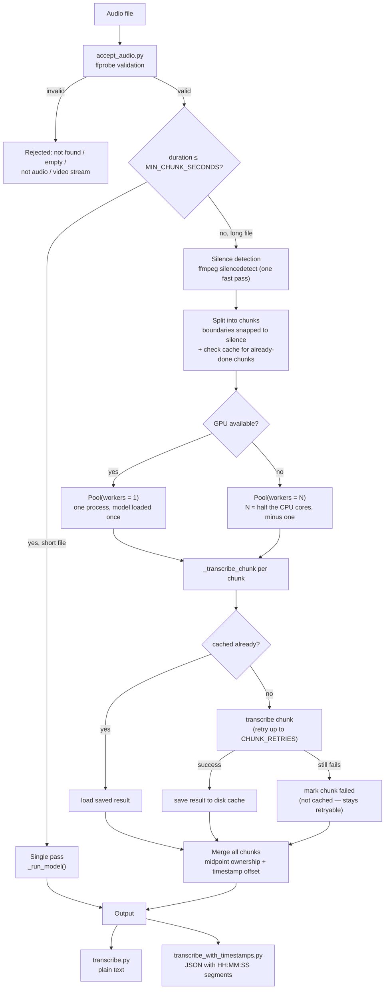

# Audio Transcription Pipeline

A simple, script-based pipeline that validates an audio file, transcribes it to text, and returns per-segment timestamps — built with engineering judgment as the focus rather than model training.

## Overview

Three scripts, each responsible for one stage, with no logic duplicated between them:

| Script | Responsibility |
|---|---|
| [`accept_audio.py`](accept_audio.py) | Validates that a file is genuinely readable audio |
| [`transcribe.py`](transcribe.py) | Transcribes audio to plain text (also the core engine — chunking, workers, caching all live here) |
| [`transcribe_with_timestamps.py`](transcribe_with_timestamps.py) | Same pipeline, but returns per-segment `HH:MM:SS` timestamps instead of one flat string |

`transcribe.py` and `transcribe_with_timestamps.py` both import `accept_audio()` from `accept_audio.py`. `transcribe_with_timestamps.py` also imports the chunking/worker internals directly from `transcribe.py` rather than reimplementing them — there is exactly one implementation of each piece of logic in this codebase.

## Setup

**Prerequisites**
- Python 3.9+
- [ffmpeg](https://ffmpeg.org/download.html) on `PATH` (provides `ffprobe`, used for validation, silence detection, and chunk splitting)

```bash
pip install -r requirements.txt
```

## Usage

```bash
python accept_audio.py audio_files/recording01.m4a
python transcribe.py audio_files/recording01.m4a
python transcribe_with_timestamps.py audio_files/recording01.m4a
```

`transcribe_with_timestamps.py` outputs JSON:
```json
{
  "language": "en",
  "segments": [
    {"start": "00:00:00", "end": "00:00:05", "text": "Good morning everyone, thank you for joining the call."},
    {"start": "00:00:05", "end": "00:00:08", "text": "Today we will discuss the quarterly results."}
  ]
}
```

Sample audio files for testing are in [`audio_files/`](audio_files/).

## Pipeline flow



If any chunk failed, the cache directory is left on disk and a rerun of the same file skips every chunk that already succeeded, retrying only what's missing (see "Resilience" below). On full success, the cache is cleared.

## Design decisions

### `accept_audio.py`: validating by content, not by filename

`accept_audio()` doesn't trust the file extension. It runs the file through `ffprobe` and inspects the actual stream data:
- No readable stream at all → rejected (covers missing, empty, corrupt, or fake files — e.g. a `.txt` renamed to `.mp3`).
- Streams present but no audio stream → rejected.
- Video stream present → rejected, even if an audio track also exists, since the brief asks for an *audio* pipeline.

Because ffprobe/ffmpeg do the actual decoding, any format they support (WAV, MP3, M4A, FLAC, OGG, etc.) works automatically — there's no per-format code to maintain.

### Model choice

Both transcription scripts use [faster-whisper](https://github.com/SYSTRAN/faster-whisper) (a CTranslate2-backed reimplementation of Whisper, chosen for speed on CPU) with the `base` checkpoint — a deliberate speed/accuracy tradeoff for a script that needs to run reasonably fast without a GPU. Swapping to a larger checkpoint (e.g. `large-v3`) is a one-line change in `_load_model()` if accuracy matters more than latency in a given context.

`vad_filter=True` is set on every transcription call, so voice-activity detection skips silence during decoding — this both speeds things up and avoids Whisper occasionally hallucinating text over dead air.

### Handling long audio

Whisper's architecture already processes audio in internal, fixed 30-second windows and stitches the result into one continuous transcript — a single `model.transcribe()` call already handles multi-hour files *correctly* with no manual splitting required. Chunking was added on top of that for two different reasons, and it's worth being explicit that they're different:

**Speed (CPU only).** Whisper's internal windowing is sequential within one process, so on CPU, splitting a long file into pieces and transcribing them in separate processes at the same time (`multiprocessing.Pool`) genuinely cuts wall-clock time. Worker count is chosen automatically, not hardcoded:

```python
auto_cap = max(1, cpu_count() // 2 - 1)
workers = min(auto_cap, max(1, int(duration // MIN_CHUNK_SECONDS)))
```

`cpu_count() // 2` approximates physical core count (hyperthreads share execution units, so they add little for CPU-bound inference like this), and `- 1` leaves a core free for the OS and ffmpeg. The result is also capped so chunks never come out shorter than `MIN_CHUNK_SECONDS` — a very short chunk pays the same fixed model-load cost as a long one, so splitting too finely can make things slower, not faster.

**Resilience (CPU and GPU both).** This is the more interesting reason chunking exists, and it applies even when there's no speed benefit at all — see below.

### GPU: same code path, not a separate implementation

A CUDA GPU is detected via `ctranslate2.get_cuda_device_count()` (no extra dependency — ctranslate2 already ships with faster-whisper). When one is present, the code does **not** branch into a different implementation. It goes through the exact same `multiprocessing.Pool` call as CPU — just with `workers = 1` instead of many. The reasoning: multiple processes contending for a single GPU, each loading its own full copy of the model into VRAM, is not a way to parallelize; it's just contention. So GPU is treated as "the CPU path with exactly one worker," which is also how it's tested (the checkpointing/retry logic is verified once, under `Pool(1)`, and that test result applies to both CPU-with-one-worker and GPU).

A `Pool` initializer (`_init_worker`) loads the model once per worker process into a module-level global and reuses it for every chunk that worker is given — this matters more on GPU, where model-load cost is the one thing you can't parallelize away, but it benefits CPU too (previously every chunk reloaded the model from scratch, even chunks handled by the same worker).

### Chunk count is deliberately decoupled from worker count

This one is subtle enough to be worth spelling out, because it was a real bug during development: `chunk_length = duration / workers` looks reasonable, but when `workers == 1` (the GPU case, always), it collapses to **one giant chunk covering the entire file** — which throws away all the resilience benefits described below, since there'd be nothing to checkpoint partway through. The fix:

```python
num_chunks = max(workers, int(duration // MIN_CHUNK_SECONDS))
chunk_length = duration / num_chunks
```

Worker count controls *parallelism*. Chunk count controls *checkpoint granularity*. They're related but not the same thing — a single-worker GPU run on a long file still gets many small chunks, processed one after another, purely so there's something to save progress against.

### Chunk boundaries are snapped to silence, not blind time marks

Cutting a file at a blind fixed-time mark risks slicing through the middle of a word or sentence — corrupting that boundary's audio for whichever chunk gets it. Instead, `_find_silence_midpoints` runs ffmpeg's `silencedetect` once over the whole file (a fast pass — no transcription involved) to find real pauses, and `_snap_to_silence` moves each nominal cut point to the nearest pause within `SNAP_SEARCH_SECONDS`. A one-second minimum silence duration (`d=1.0`) is used deliberately — short enough to catch a real pause between sentences, long enough to not catch the half-beat after a comma and risk snapping into the middle of a sentence instead of after it.

Because two neighboring chunks both get a little overlap around the boundary (`READ_PAD_SECONDS`) as a safety margin, both chunks can technically "hear" a sentence near the cut. To avoid transcribing it twice, each chunk keeps only the segments whose midpoint falls inside its own `[nominal_start, nominal_end)` window — "midpoint ownership." Whichever chunk's window contains the center of a sentence is the one that keeps it; the other chunk discards it. Getting this right took more than one attempt during development — an earlier version only protected the *start* of each chunk from duplication, not the end, and text could still appear twice near a boundary. The current midpoint-based approach is what actually eliminated that.

### Resilience: fault isolation and resumable caching

The chunking above exists for speed on CPU, but on GPU (and even CPU with only one available worker) it exists purely for this:

- **Fault isolation.** Each chunk is retried up to `CHUNK_RETRIES` times. If it still fails, it's marked with an `"error"` field rather than raising — the run continues with the remaining chunks instead of discarding everything. The final transcript comes back with everything that succeeded, plus a clear warning naming exactly which time range is missing and why.
- **Resumable caching.** Each chunk's successful result is saved to disk as JSON, in a directory keyed off the input file's absolute path, size, and modified time (`_cache_dir_for`) — so re-running the *same* file finds the *same* cache directory. If the whole process dies partway through a long file (crash, OOM, killed process), rerunning it skips every chunk that already succeeded — loaded straight from cache, no re-cutting the audio, no re-running the model — and only retries what's actually missing.
- **Failures are deliberately never cached.** If a failed result were saved the same way a success is, a rerun would keep loading that same failure forever instead of getting a genuine second attempt. Only successes go to disk; on full success, the cache directory is deleted (nothing is left lying around); on partial failure, it's left in place specifically so the next run can pick up where the last one stopped.

### Timestamps across chunk boundaries

Each chunk is cut out as its own standalone audio file, so Whisper transcribes it with no idea where in the original recording it came from — segment timestamps always start from 0 relative to that chunk. `_transcribe_chunk` corrects this by adding back `read_start` (the chunk's real start position in the original file) to every segment's start/end before merging, so the final transcript has one continuous, correct timeline even though it was built from separately-transcribed pieces.

### What's out of scope

Speaker diarization, LLM-based transcript cleanup, and running transcription as an async job behind an API (return a job ID immediately, let the caller poll or get a webhook) are all reasonable next steps for a production service, but are outside the scope of this exercise. The async-job point specifically matters once concurrent uploads are involved — see the accompanying system design notes — but isn't needed for a single-request script.
